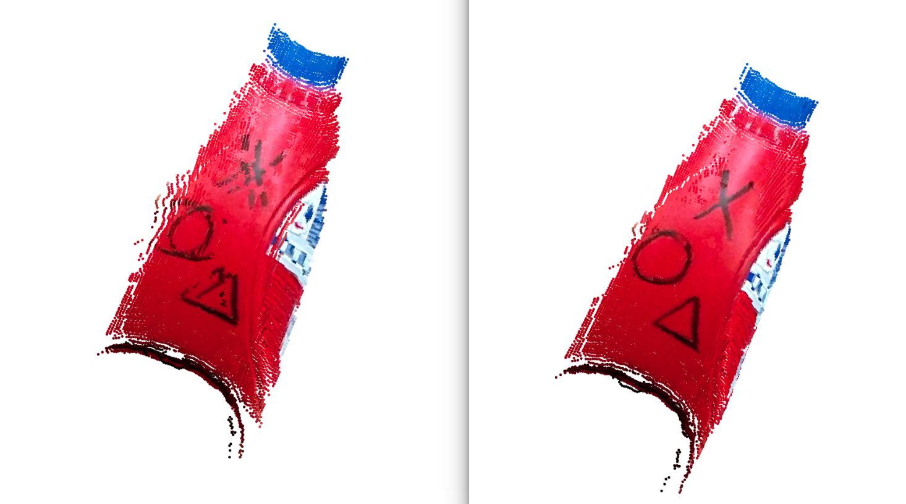
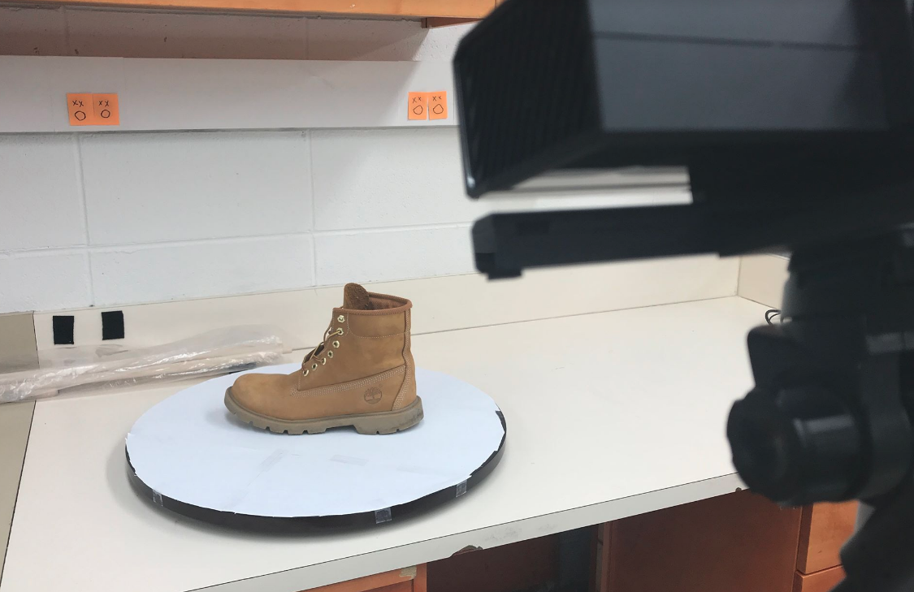

# Mini 3D-Scanner

### A pipeline for online 3D reconstruction of objects only using visual data from RGB-D camera (Kinect V2).

**Miaoding Dai**
> Winter Project in MSR, Northwestern University (Winter 2018)

_A simple demo of 3D reconstruction of a sneaker 'Kyrie4 CNY' with this pipeline. More examples see 'Demo' part._

## Demo 

Demo Video in Youtube: [Mini 3D-Scanner](https://youtu.be/WLWoPsRvhPE)

## Introduction

The goal of this project is to develop a pipeline that can do online 3D reconstruction of small scale obejects, only using visual data from RGB-D camera.

While some commercial 3D scanner can provide with more acurate reconstruction results, they have some disadvantages. Some of them are very expensive, some of them have no colors (laser scan), and some of them are limited only to be used in some particular environments with special setup.

In this project, I explored to only use visual data (color images and range images), to robustly and conveniently reconstruct objects online, which seems a more natural and smarter way for a robot to explore the world.

## Pipeline Flow

#### Overview
I used a [Kinect V2](https://www.xbox.com/en-US/xbox-one/accessories/kinect) as the RGB-D camera for my pipeline, and use [ROS](http://www.ros.org/) framework to allow communication between hardware and software, as well as different programs.

I used ROS package [iai_kinect2](https://github.com/code-iai/iai_kinect2) to drive the RGB-D camera, do registration of range image and color image, and generate raw point cloud as input data of this 3D reconstruction pipeline.

The pipeline is divided into three major parts. I used [PCL](http://pointclouds.org/) to preprocessing raw point cloud and visualize registration process. For registration part, I used [Open3D](http://www.open3d.org/).

#### Colored ICP
Open3D is a brand new library for 3D data processing, which was just released in Jan 2018. The reason I used this library for point cloud registration is that they implemented the state-of-the-art *Colored ICP* algorithm. Plus, the library has Python interface with complete documentation and examples, which is easy to use.

> [Park2017] J. Park, Q.-Y. Zhou, and V. Koltun, Colored Point Cloud Registration Revisited, ICCV, 2017.

The image above shows how effective this algorithm is. The left only used ICP with normal info of each points, while the right image first used Normal ICP for rough registration, plus Colored ICP for refinement. For some objects with rich textures on surface, with color information synthesized, this algorithm would be super powerful.

#### Flow

> This pipeline works in ROS framework.

- Input data is raw point cloud (from topic `/kinect2/qhd/points` generated by Kinect V2)
- [Preprocessing (PCL, C++)](./src/pcl_processing.cpp)
    - input: raw point cloud
        1. Crop ROI of raw point cloud
        2. Segment and get rid of the bottom turntable plane
        3. Remove outliers with statistical method
    - output: preprocessed point cloud
- [Registration (Open3D, Python)](./src/open3d_processing.py)
    - input: preprocessed point cloud
        1. Set the first point cloud as fixed base cloud
        2. For every coming point cloud, locally regitering it into last point cloud
            1. Normal ICP for rough registration
            2. Colored ICP for refinement
            3. Utilize some schemes to get rid of bad local registration
        3. When local registration is successful, regiter it into the base cloud
        4. Repetitive do step 2 and step 3 after a complete model is generated
    - output: compelete point cloud rendered model of objects
- [Visualization (PCL, C++)](./src/showRegResultOnline.cpp)
    - input: compelete point cloud rendered model of objects
        - Update the visualization window step by step, showing the process of point cloud registration

## Instruction for Use

The image above shows the setup of the 3D reconstruction pipeline. With all the ROS nodes ready, when people rotates the turntable slowly, the 3D reconstruction process is shown on the computer screen.

Feel free to download this pipeline and play with it. Hope you enjoy it. There are some tips you may want to know for an easy start.

#### Hardware
- Kinect V2 ([Kinect for XBOX One](https://www.xbox.com/en-US/xbox-one/accessories/kinect))
- Turntable
- An Ubuntu computer with ROS installed

Tips:
- The turntable should not be reflective, or Kinect V2 will generate point cloud with distortion.
- The relative position of Kinect V2 and the turntable should be set up before running the software. For this part, I will provide with an interface for easy use.

#### Software

- [ROS](http://www.ros.org/)
- catkin_tools (use `catkin build` to build this ROS package)
- [iai_kinect2](https://github.com/code-iai/iai_kinect2) (ROS package as driver for Kinect V2)
- PCL1.7.2 (C++)
- Open3D (Python)
- numpy (Python)

Intsructions for use:
1. In a ROS environment, command `$ roslaunch kinect_bridge kinect_bridge.launch` to connect Kinect V2 thtough *iai_kinect2*;
2. Command `$ roslaunch scanner pipeline.launch` to run the pipeline.
3. Intermediate PCD files are saved in **./data/** folder, and the final reconstruction PCD file is in **./data/result/** folder.

